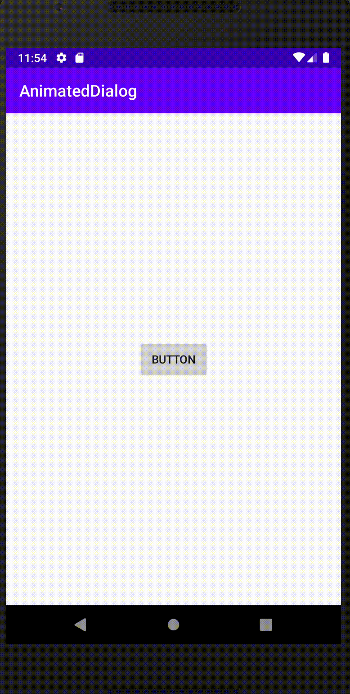

## Android Animated Dialog

Animation dialog that slides and shows when the dialog is displayed

[](https://jitpack.io/#TaeseongYun/AnimatedDialog)

__ __ __ __ __ __ __

### Using

#### step1. Add the JitPack repository to your build file

Add it in your root build.gradle at the end of repositories:

```
allprojects {
	repositories {
		...
		maven { url 'https://jitpack.io' }
	}
}
```

#### step2. add dependency
```
dependencies {
	implementation 'com.github.TaeseongYun:AnimatedDialog:lastVersion'
}
```

### Example

- Code

```kotlin
private val dialog by lazy {
        AnimatedDialog.Builder(this, R.style.MyDialogStyle)
            .setTitle(if you want title)
            .setMessage(you want message)
            .setNegativeText("cancel")
            .setPositiveText("ok")
            .setImage(R.mipmap.ic_launcher)
            //You have to set positive background and negative background when you use dialog
            .setPositiveBackground(R.drawable.bg_positive)
            .setNegativeBackground(R.drawable.bg_negative)
            .setWidth(resources.displayMetrics.widthPixels.toFloat())

            /*
            you should to set custom click listener if you want it
            */

            .setNegativeClickListener {  }
            .setPositiveClickListener {  }

            /*
            DialogSize SMALL -> window.height / 3
            DialogSize NORMAL -> window.height / 2
            DialogSize LARGE -> windlw.height
            */
            .setDialogSize(DialogSize.SMALL)
            /*
            Duration SLOW -> 300
            Duration NORMAL -> 200
            Duration FAST -> 100
            */
            .setDuration(Duration.SLOW)
            .build()
    }
```

- xml

```xml
<?xml version="1.0" encoding="utf-8"?>
<LinearLayout xmlns:android="http://schemas.android.com/apk/res/android"
    xmlns:tools="http://schemas.android.com/tools"
    android:layout_width="match_parent"
    android:layout_height="wrap_content"
    android:layout_marginStart="30dp"
    android:layout_marginEnd="30dp"
    android:background="@drawable/inset_bg"
    android:orientation="vertical">

    <ImageView
        android:id="@+id/image_view"
        android:layout_width="match_parent"
        android:layout_height="wrap_content"
        android:layout_marginTop="16dp" />

    <TextView
        android:id="@+id/title"
        android:layout_width="match_parent"
        android:layout_height="wrap_content"
        android:layout_gravity="center"
        android:layout_marginTop="8dp"
        android:gravity="center"
        android:textColor="@android:color/black"
        tools:text="hi" />

    <TextView
        android:id="@+id/positive_button"
        android:layout_width="match_parent"
        android:layout_height="wrap_content"
        android:layout_gravity="center"
        android:layout_marginStart="20dp"
        android:layout_marginTop="12dp"
        android:layout_marginEnd="20dp"
        android:gravity="center"
        android:paddingTop="10dp"
        android:paddingBottom="10dp"
        android:textColor="@android:color/white"
        android:textSize="14sp"
        android:textStyle="bold"
        tools:text="확인" />

    <TextView
        android:id="@+id/cancel_button"
        android:layout_width="match_parent"
        android:layout_height="wrap_content"
        android:layout_gravity="center"
        android:layout_marginStart="20dp"
        android:layout_marginTop="8dp"
        android:layout_marginEnd="20dp"
        android:layout_marginBottom="12dp"
        android:gravity="center"
        android:paddingTop="10dp"
        android:paddingBottom="10dp"
        tools:text="취소" />
</LinearLayout>
```

#### You need to set image_view, title, positive button and cancel button respectively as id in xml.


__ __ __ __ __ __ __


### Result 




### Reference

[Dialog-Android](https://github.com/jianyuyouhun/AnimatedDialog)


